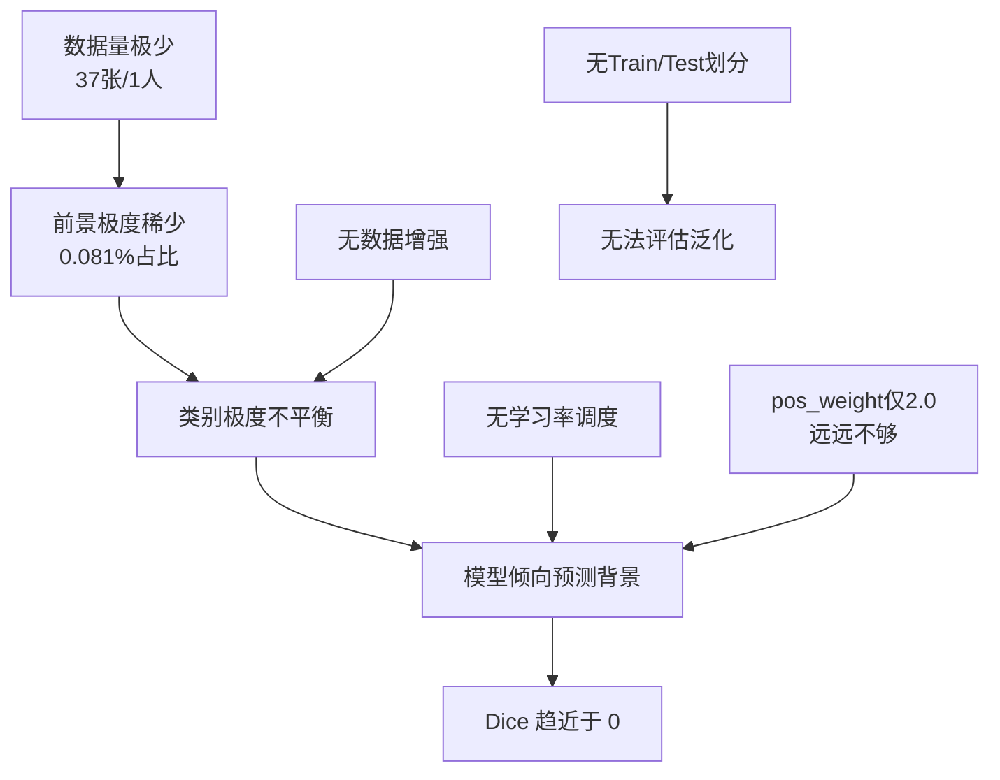

# CTAI 模型诊断报告

> 基于代码审查、训练曲线分析、可视化结果和 Ground Truth 统计的完整诊断

---

## 1. 任务与数据

| 项目 | 详情 |
|------|------|
| **任务** | 直肠癌（Rectal Cancer）CT 图像中的肿瘤区域分割 |
| **数据集** | 私有数据集 `直肠癌数据_tiny/`，单一患者（ID:1002） |
| **数据模态** | CT（DICOM 格式），动脉期（arterial phase）扫描 |
| **图像维度** | 2D 切片，每张 512×512 灰度图 |
| **样本数** | **仅 37 张切片**（1个患者 × 37层），**无数据划分**（train/test 相同） |
| **标注** | 每张切片附带 `_mask.png` 二值掩膜 |
| **GT 前景占比** | **~0.081%**（极度不平衡，37张中多数为纯背景） |

> [!CAUTION]
> **核心数据问题：** 37 张来自同一患者的切片远远不足以训练任何有效的分割模型。大部分切片（如 10001~10012）的 mask 为全黑（无肿瘤），只有少数切片有极小的肿瘤标注。

---

## 2. 模型架构

### 2.1 标准 U-Net（当前部署）

| 项目 | 详情 |
|------|------|
| **架构** | 经典 U-Net (4层编码+4层解码) |
| **文件** | [unet.py](file:///c:/Users/da983/CAT_2Ck/CTAI-master/CTAI_model/net/unet.py) |
| **输入** | `[B, 1, 512, 512]` 单通道灰度 |
| **输出** | `[B, 1, 512, 512]` 经 Sigmoid 的概率图 |
| **通道** | 64→128→256→512→1024→512→256→128→64→1 |
| **参数量** | ~31M（118.5 MB 权重文件） |
| **权重文件** | `CTAI_flask/core/net/model.pth`（`baseline_weights.pth`） |

### 2.2 Attention U-Net（训练备选）

| 项目 | 详情 |
|------|------|
| **架构** | Attention U-Net — skip connection 处加 Attention Gate |
| **文件** | [attention_unet.py](file:///c:/Users/da983/CAT_2Ck/CTAI-master/CTAI_model/net/attention_unet.py) |
| **差异** | 在 4 个 skip connection 上各加了 `AttentionGate` |
| **注意** | 输出 **不带 Sigmoid**（用 BCEWithLogitsLoss 训练） |
| **权重** | `attention_weights.pth` / `best_model_weights_tiny.pth`（119.9 MB） |

> [!WARNING]
> 当前部署的 `model.pth` 是**标准 U-Net** 的权重，但 Attention U-Net 的 `best_model_weights_tiny.pth` 在 tiny 数据上效果更好。两者架构不同，不可互换！

---

## 3. 训练配置

| 项目 | Baseline U-Net | Attention U-Net (tiny) |
|------|---------------|----------------------|
| **损失函数** | 不明确 | BCE + SoftDiceLoss (各0.5) |
| **BCE pos_weight** | — | `2.0` |
| **优化器** | Adam | Adam |
| **学习率** | — | `1e-3` (无 scheduler) |
| **Batch Size** | — | `2` |
| **Epochs** | — | `50`（但 tiny 数据上约 14 epoch 可见结果） |
| **数据增强** | **无** | **无** |
| **Train/Test 划分** | 不确定 | `get_d1()` 返回同一份数据（无划分） |
| **过滤** | — | 只保留有前景的样本 |

> [!IMPORTANT]
> **没有做任何数据增强**（翻转、旋转、弹性变形等）。对于只有 37 张图的极小数据集，这是致命的。

---

## 4. 当前表现

### 4.1 训练曲线分析

````carousel
#### Attention U-Net 训练曲线


- **Train Loss:** 从 ~0.7 下降到 ~0.09（收敛）
- **Test Dice:** 最高只到 **0.15**，然后迅速跌至 **0.0**
- **判断:** 模型在前几个 epoch 短暂学到了一些前景模式，但随后**过拟合到背景**

<!-- slide -->

#### Baseline U-Net 训练曲线


- **Train Loss:** 从 ~0.72 下降到 ~0.18（收敛更慢）
- **Test Dice:** 最高只到 **0.23**，然后跌至 **0.0**
- **判断:** 同样的过拟合到背景模式
````

### 4.2 可视化分析

````carousel
#### Epoch 1（初始状态）


- 模型输出范围 `[0.48, 0.51]`，整体接近 0.5
- 二值化后大面积误报（全图标为前景）
- **结论：** 模型完全未学到任何有用特征

<!-- slide -->

#### Epoch 14（最终状态）


- 模型输出范围降到 `[0.05, 0.45]`
- 所有输出均低于 0.5 阈值 → 二值化后**全黑（全部判为背景）**
- GT 中的小白点（肿瘤）完全未被检测到
- **结论：** 模型彻底"放弃"了前景，全部预测为背景以最小化 loss
````

### 4.3 部署模型实测

| 指标 | 数值 | 说明 |
|------|------|------|
| **模型输出范围** | `[0.17, 0.66]` | 最大概率仅 0.66 |
| **阈值 0.5 前景** | 18.4% | 远大于 GT 的 0.081% |
| **阈值 0.56 前景** | ~2% | 手动调高阈值的结果 |
| **阈值 0.7 前景** | 0% | 无任何像素超过 0.7 |

> **2% 前景是我们人为提高阈值到 0.56 的结果**，并非模型真正学到了肿瘤位置。模型实际上是在做**模糊的身体区域 vs 背景**分类，而非肿瘤分割。

### 4.4 模型倾向

当前部署的 `model.pth`（baseline U-Net）：

- 阈值 0.5 → **严重误报**（FP 极多），把 18% 的像素标为前景
- 阈值 0.56+ → **严重漏检**（FN 极多），基本检不到真正的肿瘤

**本质问题：** 模型没有学到"什么是肿瘤"，只学到了"什么是非黑色背景区域"。

---

## 5. 后处理

| 项目 | 当前状态 | 建议 |
|------|---------|------|
| **推理阈值** | ~~0.5~~ → 已调为 0.56 | 需要 ROC 分析确定最优阈值 |
| **连通域过滤** | ❌ 无 | 应添加（去除小区域噪声） |
| **形态学操作** | ❌ 无 | 应添加开运算/闭运算 |
| **面积过滤** | ❌ 无 | 应过滤过大/过小区域 |
| **可视化** | ✅ 已改为半透明叠加 | — |

---

## 6. 核心问题诊断

### 🔴 根本原因：数据严重不足

```
只有 1 个患者、37 张切片、0.081% 前景占比
→ 这不是一个模型问题，而是一个数据问题
```

### 问题链：



### 具体问题清单：

| # | 问题 | 严重度 | 说明 |
|---|------|--------|------|
| 1 | **数据量不足** | 🔴 致命 | 37 张图远不够训练 U-Net（通常需要数百到数千张） |
| 2 | **无数据划分** | 🔴 致命 | `get_d1()` 返回相同数据做训练和测试，无法评估泛化性 |
| 3 | **前景极度稀少** | 🔴 严重 | 0.081% 的前景占比，大多数切片无肿瘤 |
| 4 | **无数据增强** | 🟡 严重 | 在小数据集上不做增强等于浪费学习机会 |
| 5 | **pos_weight 不足** | 🟡 中等 | pos_weight=2 对 0.081% 的不平衡完全不够（建议 50+） |
| 6 | **无学习率调度** | 🟡 中等 | 固定 lr=1e-3 容易跳过最优解 |
| 7 | **Sigmoid vs Logits 不一致** | 🟡 中等 | U-Net 自带 Sigmoid，Attention U-Net 不带 |
| 8 | **权重文件不匹配** | 🟡 中等 | 部署用 baseline U-Net，但最好的权重是 Attention U-Net |

---

## 7. 项目各模块打包清单

### 模型代码

| 文件 | 路径 | 说明 |
|------|------|------|
| U-Net 定义 | `CTAI_model/net/unet.py` | 标准 4层 U-Net |
| Attention U-Net | `CTAI_model/net/attention_unet.py` | 带 Attention Gate 的 U-Net |
| 训练脚本 | `CTAI_model/net/train.py` | 训练主循环（Attention U-Net + BCE+Dice） |
| 测试脚本 | `CTAI_model/net/test.py` | 推理并输出 mask |
| 数据加载器 | `CTAI_model/data_set/make.py` | Dataset 定义 + DICOM 读取 |
| Dice Loss | `CTAI_model/utils/dice_loss.py` | Dice 系数计算 + Soft Dice Loss |
| 时序模型 | `CTAI_model/net/time_series_model.py` | LSTM 时序预测模型 |
| 特征提取 | `CTAI_model/cv/get_ROI-all.py` | 批量 ROI 提取 |
| 特征提取 | `CTAI_model/cv/get_all_feature.py` | 批量特征计算 |

### 模型权重

| 文件 | 大小 | 模型 | 来源 |
|------|------|------|------|
| `baseline_weights.pth` | 118.5 MB | U-Net | Baseline 训练 |
| `baseline_unet_weights.pth` | 118.5 MB | U-Net | 同上（备份） |
| `attention_weights.pth` | 119.9 MB | Attention U-Net | Attention 训练 |
| `best_model_weights_tiny.pth` | 119.9 MB | Attention U-Net | tiny 数据最佳 |
| `model.pth`（部署） | 118.5 MB | U-Net | = baseline_weights.pth |

### 数据集

| 目录 | 内容 |
|------|------|
| `直肠癌数据_tiny/1002/arterial phase/` | 37 张 DCM + 37 张 mask (仅 1 位患者) |

### 测试文件（TEST 目录）

| 文件 | 说明 |
|------|------|
| `TEST/dcm_samples/10013.dcm` | 真实直肠 CT (520KB) |
| `TEST/dcm_samples/test_sample.dcm` | 模拟生成 CT (513KB) |
| `TEST/screenshots/` | 14 张功能测试截图 |
| `TEST/model_weights/README.md` | 权重文件说明 |

---

## 8. 当前进度

### ✅ 已完成

| 模块 | 状态 | 说明 |
|------|------|------|
| 前端 UI | ✅ | 全部功能已实现（患者管理/上传/分析/趋势/LLM） |
| 后端 API | ✅ | Flask RESTful API 完整 |
| LLM 多模型 | ✅ | 支持通义千问/DeepSeek/OpenAI/Ollama |
| 时序预测 | ✅ | LSTM + 线性回归 |
| 数据库 | ✅ | SQLite 完整（患者/诊断/趋势/LLM报告） |
| 一键启动 | ✅ | `start_all.ps1` |
| 自动截图 | ✅ | Selenium 自动化 14 张截图 |

### ⚠️ 部分完成

| 模块 | 状态 | 说明 |
|------|------|------|
| 肿瘤分割模型 | ⚠️ | 模型可运行，但分割精度极差（Dice≈0） |
| 可视化 | ⚠️ | 已改为半透明叠加，但模型输出本身不准 |

### 🔴 未完成 / 瓶颈

| 模块 | 状态 | 说明 |
|------|------|------|
| **有效的分割模型** | 🔴 | **核心瓶颈** — 需要更多标注数据或预训练模型 |
| 后处理流程 | 🔴 | 无连通域过滤、形态学操作 |
| 模型评估 | 🔴 | 无独立测试集，无量化指标 |

---

## 9. 改进建议（优先级排序）

### 🏆 P0 — 解决数据不足（核心）

1. **获取更多标注数据**
   - 至少 10+ 位患者，共 300+ 张标注切片
   - 或使用公开直肠癌数据集（如 [MSD Colon](http://medicaldecapseg.com/) Task10）

2. **使用预训练权重**
   - 用在大数据集上预训练的 U-Net 编码器（如 ImageNet 或 medical pretraining）
   - 迁移学习：冻结编码器，只训练解码器

### 🥇 P1 — 训练改进

3. **数据增强**（代码改动最小的提升）
   ```python
   # 建议添加的增强
   - 随机水平/垂直翻转
   - 随机旋转 ±30°
   - 随机缩放 0.8-1.2
   - 弹性变形
   - 亮度/对比度抖动
   ```

4. **调整类别平衡**
   - `pos_weight` 从 2.0 提高到 **50-100**
   - 或使用 Focal Loss 替代 BCE

5. **学习率调度**
   - 添加 `CosineAnnealingLR` 或 `ReduceLROnPlateau`

### 🥈 P2 — 工程改进

6. **添加后处理**
   - 连通域分析：去除 < 100 像素的小区域
   - 形态学开运算：去除噪点
   - 面积约束：肿瘤面积应在合理范围内

7. **模型评估 pipeline**
   - 独立测试集
   - 计算 Dice / IoU / Precision / Recall
   - ROC 曲线确定最优阈值

### 🥉 P3 — 架构改进

8. **切换为 Attention U-Net**
   - 当前部署用标准 U-Net，Attention U-Net 更适合小目标检测
   - 需修改 `app.py` 中的模型加载代码

9. **尝试更先进的架构**
   - nnU-Net（自适应配置，医学分割 SOTA）
   - TransUNet（Transformer + U-Net）

---

## 10. 目标指标

| 阶段 | Dice Score 目标 | 所需条件 |
|------|----------------|---------|
| **当前** | ~0.0 | — |
| **短期目标** | > 0.3 | 数据增强 + pos_weight 调整 + 后处理 |
| **中期目标** | > 0.6 | 更多数据（5+ 患者）+ 预训练 + 学习率调度 |
| **论文级目标** | > 0.8 | 充足数据（20+ 患者）+ 先进架构 + 全面调参 |
